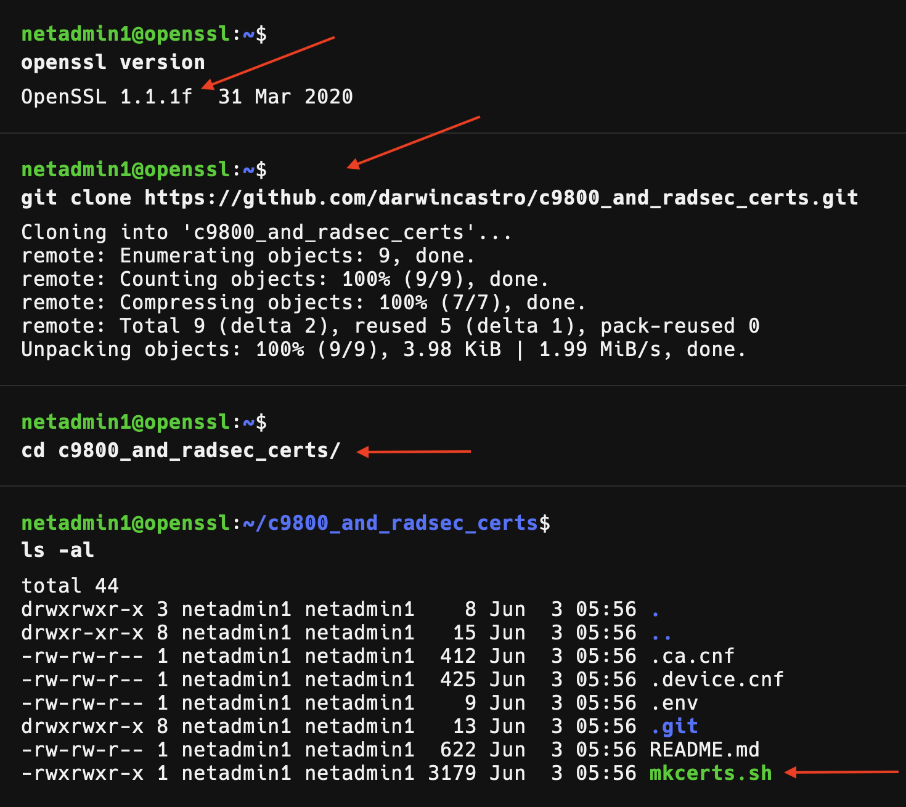

# Certificates Generation Script

This script generates a Certificate Authority (CA) and two device certificates (WLC and RADSEC Server certificate) signed by the CA. The certificates are used for securing communication between network devices and FreeRADIUS server.

## Prerequisites

OpenSSL v1.1.1f or LibreSSL 3.3.6

## Steps to generate the certificate bundle:

1. Clone the repository, and go to the directory.

```sh
git clone https://github.com/darwincastro/c9800_and_radsec_certs.git
```

```sh
cd c9800_and_radsec_certs
```
2. Run the script:

```sh
./mkcerts.sh
```

**The output should look like the following:**



3. The first block of information belongs to the CA, use any information that you like, and make sure to use your domain name under the "common name" section, like; "example.com"

> [!NOTE]  
> The script supports one hostname, and one IP address, if you are planning to use multiple IPs & names feel free to modify the code at your convenience.


4. The second block belongs to the Cisco C9800 controller

> [!TIP]
> Under "FQDN input" Copy and paste the FQDN you just added.


5. The third block belongs to the RADSec server

> [!TIP]
> Under "FQDN input" Copy and paste the FQDN you just added.


## Example Output

### Configure the Trustpoint in Your Network WLC

Use the following commands to configure the trustpoint:

```
crypto pki import <trustpoint name> pem terminal password cisco
 <paste contents of ca.pem>
 <paste contents of wlc.key>
 <paste contents of wlc.pem>
```

### Configure the RADSEC Certificates in FreeRADIUS

Move the generated certificates to the FreeRADIUS certificates directory:

```sh
mv ca.pem /etc/freeradius/3.0/certs/ca.pem
mv radsec.pem /etc/freeradius/3.0/certs/radsec.pem
mv radsec.key /etc/freeradius/3.0/certs/radsec.key
```

### Bonus: Create a PKCS#12 File

For version 17.12.1 or above :
Create a PKCS#12 file for your WLC, use the following command in the same working directory:

```sh
openssl pkcs12 -export -out radsec_chain.pfx -inkey wlc.key -in wlc.pem -certfile ca.pem
```

This command creates a PKCS#12 file named radsec_chain.pfx, containing the WLC key, WLC certificate, and CA certificate.

> [!IMPORTANT]  
> - Ensure the .ca.cnf and .device.cnf configuration files are correctly set up and present in the same directory as the script.
> - The script assumes the password specified in the .env file is cisco. Adjust the password as needed.
