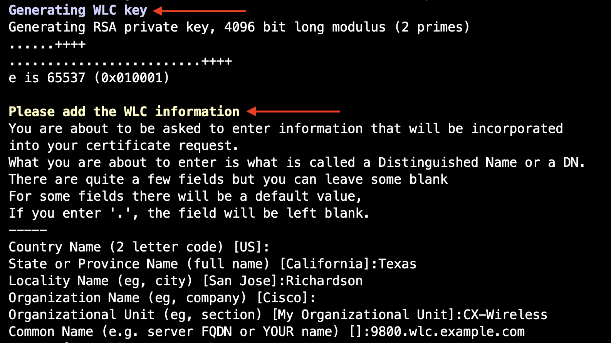
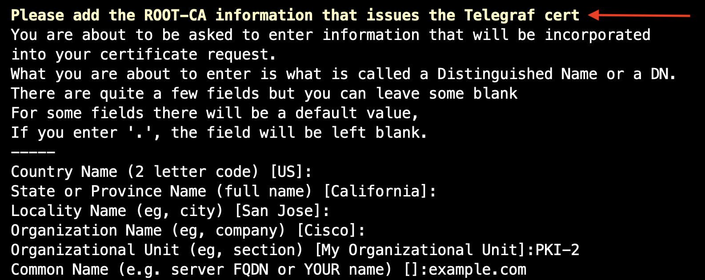

# OpenSSL Certificate Generation Script

This script generates a Certificate Authority (CA) and two device certificates for Mutual-TLS (mTLS) exchange between a WLC and Telegraf server(s) both certificates are signed by the same CA. The certificates are used for securing communication between network devices and a Telegraf server.
***
## Prerequisites

OpenSSL v1.1.1f or LibreSSL 3.3.6
***
## Steps to generate the certificate bundle:

1. Clone the repository, and go to the directory.

```sh
git clone https://github.com/darwincastro/mTLS_c9800_and_collector_certs.git
cd mTLS_c9800_and_collector_certs
```
2. Update `collector_extfile.cnf`

This script will append Subject Alternative Names (SAN) for the Telegraf server, which helps with WLC validation. Users need to update the collector_extfile.cnf file accordingly. You can add or remove DNS names and IP addresses as needed.

Example;

```sh
nano collector_extfile.cnf
```

```sh
subjectAltName = @alt_names

[alt_names]
DNS.1 = collector1.example.com
DNS.2 = collector2.example.com
DNS.3 = collector3.example.com
IP.1 = 192.168.10.1
IP.2 = 192.168.10.2
IP.3 = 192.168.10.3
```
***
> **Note:**
>Update or delete the entries in `collector_extfile.cnf` based on your requirements. Each subjectAltName can be on a new line for better readability.
***

3. Run the script:

```sh
./mkcerts.sh
```
The script checks if OpenSSL is installed on your system. If not, it exits with an error message.

**The output should look like the following:**


4. The first block of information belongs to the CA, use any information that you like, and make sure to use your domain name under the "common name" section, like; "example.com"


5. The second block belongs to the Cisco C9800 controller



5. The third block belongs to the Telegraf server


***

## Configure the Trustpoint in Your C9800

Use the following commands to configure the trustpoint:

```
crypto pki import <trustpoint name> pem terminal password cisco
 <paste contents of ca.pem>
 <paste contents of wlc.key>
 <paste contents of wlc.pem>
```

***
> **Note:**
>The script also generates a PKCS#12 file named WLC.pfx, containing the WLC key, WLC certificate, and CA certificate.
***

Upload the file WLC.pfx to `bootflash:` and run:

```sh
crypto pki import <trustpoint> pkcs12 bootflash:WLC.pfx password <securePassword> 
```
### Collector Certs in Telegraf

Move the generated certs to the appropriate directory for Telegraf:
```sh
mv ca.pem /etc/telegraf/certs/ca.pem
mv collector.pem /etc/telegraf/certs/collector.pem
mv collector.key /etc/telegraf/certs/collector.key
```
***
> [!IMPORTANT]  
> - Ensure the .ca.cnf and .device.cnf configuration files are correctly set up and present in the same directory as the script.
> - The script assumes the password specified in the .env file is cisco. Adjust the password as needed.
> - Ensure you have the necessary permissions to move and access these files.
> - Ensure you have the necessary permissions to move and access these files.
***

## License

This project is licensed under the MIT License. See the [LICENSE](./LICENSE) file for details.

***